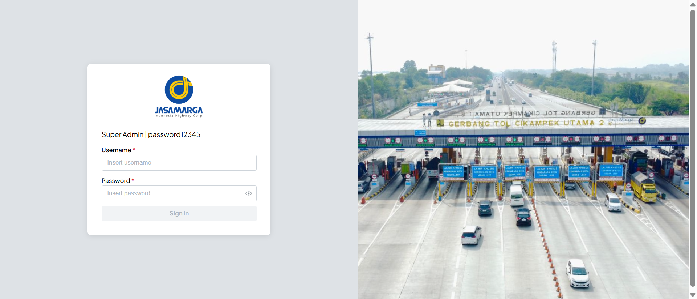
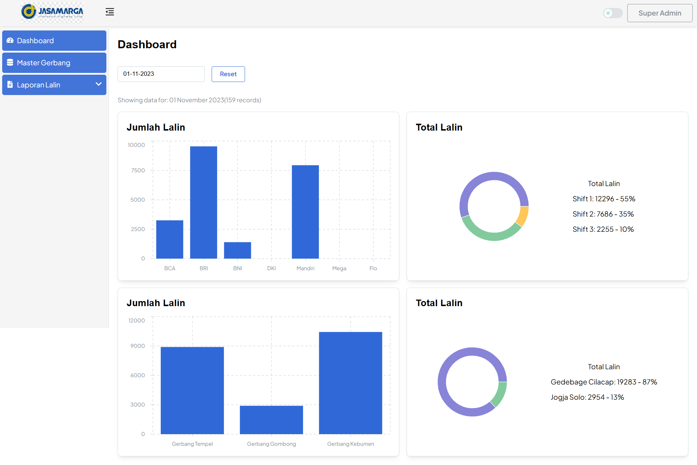
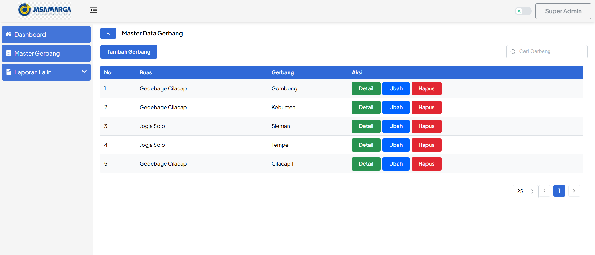
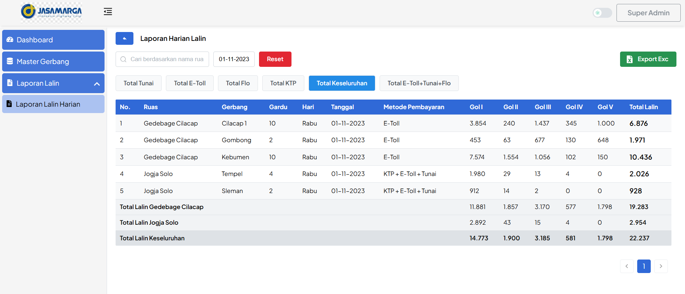

# Jasa Marga - Toll Gate Traffic Report System

## Installation

```bash
npm install
```

Change `.env.example` to `.env` and configure the values.

Run backend server on port 8080.

```bash
npm run dev
```

## Screenshots

### Login Page



### Dashboard



### Master Gerbang



### Report


